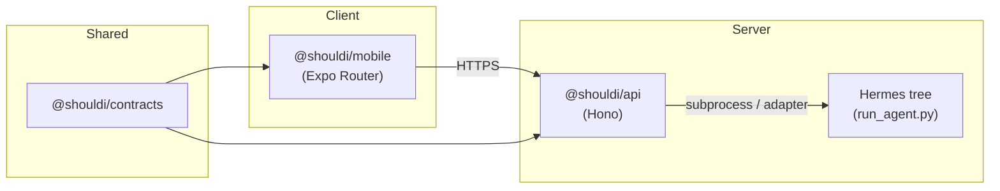

## Architecture

### Goals

1. **`@shouldi/mobile`** speaks only HTTPS to **`@shouldi/api`** — no embedded Python runtime in the Expo bundle.
2. **One source of truth** for wire shapes: **`@shouldi/contracts`** (Zod).
3. **Hermes** is optional at dev time but anchored at vendored `./hermes-agent-private` unless overridden by env.

### High-level flow

### Layers

| Layer | Responsibility |
| ------ | ---------------- |
| **`apps/mobile`** | Navigation, UX, calling the API (`EXPO_PUBLIC_API_URL`), displaying errors and loading states. |
| **`apps/api`** | HTTP routes, auth placeholders, validation via Zod imports from **`@shouldi/contracts`**, Hermes discovery and bridging. |
| **`packages/contracts`** | Schemas + TypeScript types for cross-boundary data. Published only as workspace package (no standalone npm publish assumed). |

### Operational notes

- **Repo root**: `shouldi-repo-root/` contains `apps/`, `packages/`, `hermes-agent-private/`, and a single **`package-lock.json`** for workspaces.
- **Build order**: dependents expect **`@shouldi/contracts`** `dist/` to exist; `predev` / `prestart` on the API triggers a contracts build — run `npm run build -w @shouldi/contracts` after clone or contracts changes before typechecking other packages alone.
